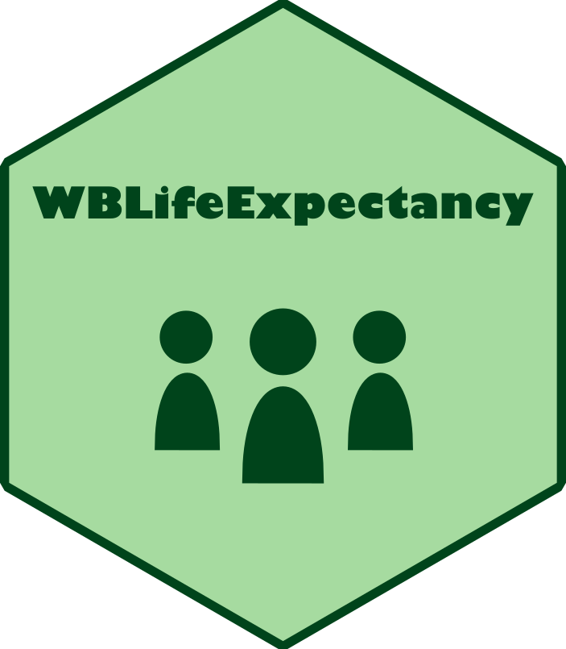

<!-- badges: start -->
  [](https://github.com/nrennie/WBLifeExpectancy/actions)
<!-- badges: end -->

# WBLifeExpectancy 

An R package for analysing and visualising World Bank life expectancy data.

## Installation

Install using:

```
remotes::install_github("nrennie/WBLifeExpectancy")
```

or 

```
devtools::install_github("nrennie/WBLifeExpectancy")
```